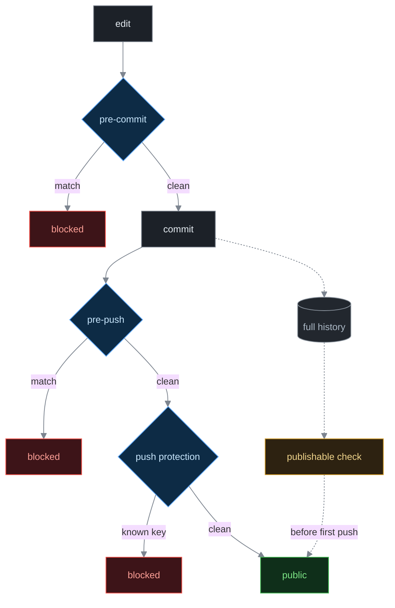

# publishable

`publishable` checks whether a git repository can be made public. It reads your whole history, because a file you deleted last month is still public the moment you push.

It looks for what a secret scanner skips: absolute home paths, real names, internal hostnames, and the working notes a coding agent leaves behind.

[](https://github.com/Anneo22/publishable/actions/workflows/checks.yml)


## Why

[gitleaks](https://github.com/gitleaks/gitleaks) will find an AWS key. It will not tell you that `settings.py` used to contain `/Users/alice/`, that a fixture names a real person, or that your agent left a hand-off journal in `HANDOFF.md` describing how you work.

That is where most small-project leaks come from. None of it is a credential, so nothing flags it, and all of it is permanent once pushed.

## Install

```sh
git clone https://github.com/Anneo22/publishable.git
cd publishable && ./install.sh
```

Needs `git` and [gitleaks](https://github.com/gitleaks/gitleaks). [`gh`](https://cli.github.com) and `jq` are optional and only add repository-description checks.

`install.sh` puts the hooks in `~/.git-template` and points [`init.templateDir`](https://git-scm.com/docs/git-init#Documentation/git-init.txt---templatelttemplate-directorygt) at it, so everything you clone or create from then on inherits them. It prints what it changed and will not overwrite an existing template silently.

Already-existing repositories need `git init` re-run inside them to pick the hooks up. That is safe and leaves history alone.

## Use

```sh
publishable check ~/code/my-app
```

Findings split into two kinds, and the split decides what you do.

**Working tree** — in the files as they are now. Edit, commit, done.

**History** — in commits. Deleting the file does nothing, and rewriting history is unreliable: a fork keeps the old objects, [GitHub will not remove data from someone else's fork](https://docs.github.com/en/authentication/keeping-your-account-and-data-secure/removing-sensitive-data-from-a-repository), and rewritten commits stay reachable by SHA. For a repository already public, rotate and disclose. For one that is not, export the clean tree into a fresh repository with one initial commit.

Exit codes: `0` clean, `1` findings, `2` usage error. Output is readable in a terminal and machine-parseable when piped, so `publishable check . | grep BLOCKING` works with no flag.

A repository with no commits reports `history UNSCANNED`. There is nothing to scan yet, and calling that clean would be the most dangerous kind of wrong answer.

## Your rules

`publishable` ships no personal patterns, because yours are not mine.

```sh
cp personal.toml.example ~/.config/gitleaks/personal.toml
```

It [extends](https://github.com/gitleaks/gitleaks#configuration) the default gitleaks ruleset, so you keep every credential pattern and add your own:

```toml
[[rules]]
id = "personal-absolute-home-path"
description = "Replace this absolute home path with $HOME or a runtime-configured path."
regex = '''/Users/YOURNAME(?:/|["'`[:space:]]|$)'''
keywords = ["/Users/YOURNAME"]
```

Write `description` as the fix. You read it at the moment you are blocked, and "replace this with `$HOME`" gets acted on where "personal path detected" gets overridden.

Keep the rules file out of your repositories. It lists the strings you most want to keep private.

With no rules file, `publishable` refuses to scan. A security tool that returns clean because it was misconfigured is worse than none.

## Starting clean

```sh
publishable init my-app --lang python
```

Scaffolds a repository that needs no cleanup before publishing: a `.gitignore` covering the files that leak most often, a config example plus a loader reading from `~/.config/<name>/`, [`docs/adr/`](https://adr.github.io) for decisions, a README skeleton, and CI that fails when the README stops being true.

It asks once for the values that are yours and stores them in `~/.config/publishable/config`. It will not invent a default author.

The rule underneath: **anything that changes when the person changes belongs outside the repository.** The repository carries the questions. Your machine carries the answers.

## Where the checks fire



Each gate sees less than the one before it. The hooks only see what is passing through them right now, which is why they cannot catch what is already in your history. `publishable check` is the one that reads everything, and it is what you run before a first push.

[GitHub's push protection](https://docs.github.com/en/code-security/secret-scanning/introduction/about-push-protection) is the only layer no local bypass reaches, and it only knows about known provider patterns. It stops a Stripe key. It will never stop your home directory path.

## Why shouldn't I use this?

- **It only finds what you describe.** The rules are regexes. A personal fact you never wrote a pattern for is invisible, and nothing in this space solves that.
- **It is not a credential scanner.** It extends gitleaks rather than replacing it. For verified secret detection add [TruffleHog](https://github.com/trufflesecurity/trufflehog).
- **It cannot help after the fact.** Once history is public, forks make it permanent. This is for the moment before the first push.
- **Rules need tuning.** Too broad and you override it constantly, which is how guards get uninstalled. Start narrow.
- **Bash and git only.** No Windows without WSL.

For a hosted scanner with a dashboard and verified secrets, use [GitGuardian](https://www.gitguardian.com) or TruffleHog. This is local, offline, and single-purpose.

## License

MIT, see [LICENSE](LICENSE).
